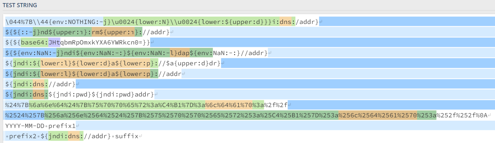
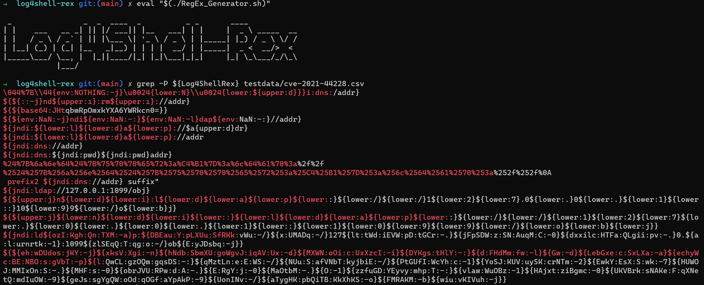
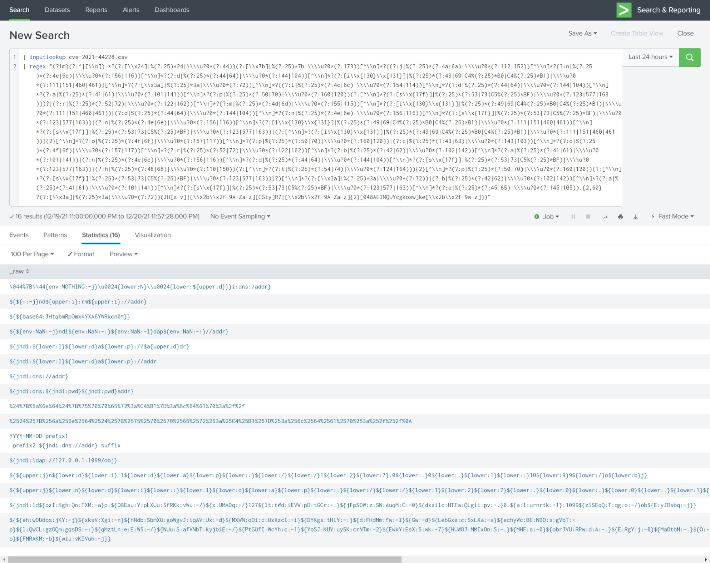
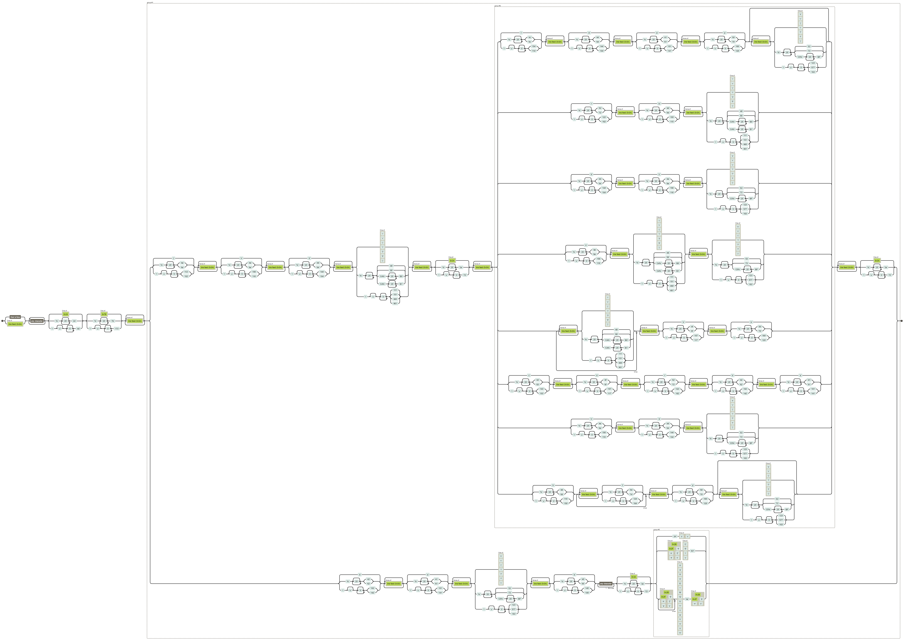

# Log4Shell-Rex

The following RegEx was written in an attempt to match indicators of a Log4Shell (CVE-2021-44228 and
CVE-2021-45046) exploitation.

**If you run a version from pre 2021/12/21, it's highly recommended to test and update.**\
I've removed some quirks and enhanced performance.

The Regex aims being PCRE compatible, but should also run on re2 and potentially more RegEx engines.

**RegEx:**
```regex
(?im)(?:^|[\n]).*?(?:[\x24]|%(?:25)*24|\\u?0*(?:44))(?:[\x7b]|%(?:25)*7b|\\u?0*(?:173))[^\n]*?((?:j|%(?:25)*(?:4a|6a)|\\u?0*(?:112|152))[^\n]*?(?:n|%(?:25)*(?:4e|6e)|\\u?0*(?:156|116))[^\n]*?(?:d|%(?:25)*(?:44|64)|\\u?0*(?:144|104))[^\n]*?(?:[i\x{130}\x{131}]|%(?:25)*(?:49|69|C4%(?:25)*B0|C4%(?:25)*B1)|\\u?0*(?:111|151|460|461))[^\n]*?(?:[\x3a]|%(?:25)*3a|\\u?0*(?:72))[^\n]*?((?:l|%(?:25)*(?:4c|6c)|\\u?0*(?:154|114))[^\n]*?(?:d|%(?:25)*(?:44|64)|\\u?0*(?:144|104))[^\n]*?(?:a|%(?:25)*(?:41|61)|\\u?0*(?:101|141))[^\n]*?(?:p|%(?:25)*(?:50|70)|\\u?0*(?:160|120))(?:[^\n]*?(?:[s\x{17f}]|%(?:25)*(?:53|73|C5%(?:25)*BF)|\\u?0*(?:123|577|163)))?|(?:r|%(?:25)*(?:52|72)|\\u?0*(?:122|162))[^\n]*?(?:m|%(?:25)*(?:4d|6d)|\\u?0*(?:155|115))[^\n]*?(?:[i\x{130}\x{131}]|%(?:25)*(?:49|69|C4%(?:25)*B0|C4%(?:25)*B1)|\\u?0*(?:111|151|460|461))|(?:d|%(?:25)*(?:44|64)|\\u?0*(?:144|104))[^\n]*?(?:n|%(?:25)*(?:4e|6e)|\\u?0*(?:156|116))[^\n]*?(?:[s\x{17f}]|%(?:25)*(?:53|73|C5%(?:25)*BF)|\\u?0*(?:123|577|163))|(?:n|%(?:25)*(?:4e|6e)|\\u?0*(?:156|116))[^\n]*?(?:[i\x{130}\x{131}]|%(?:25)*(?:49|69|C4%(?:25)*B0|C4%(?:25)*B1)|\\u?0*(?:111|151|460|461))[^\n]*?(?:[s\x{17f}]|%(?:25)*(?:53|73|C5%(?:25)*BF)|\\u?0*(?:123|577|163))|(?:[^\n]*?(?:[i\x{130}\x{131}]|%(?:25)*(?:49|69|C4%(?:25)*B0|C4%(?:25)*B1)|\\u?0*(?:111|151|460|461))){2}[^\n]*?(?:o|%(?:25)*(?:4f|6f)|\\u?0*(?:157|117))[^\n]*?(?:p|%(?:25)*(?:50|70)|\\u?0*(?:160|120))|(?:c|%(?:25)*(?:43|63)|\\u?0*(?:143|103))[^\n]*?(?:o|%(?:25)*(?:4f|6f)|\\u?0*(?:157|117))[^\n]*?(?:r|%(?:25)*(?:52|72)|\\u?0*(?:122|162))[^\n]*?(?:b|%(?:25)*(?:42|62)|\\u?0*(?:102|142))[^\n]*?(?:a|%(?:25)*(?:41|61)|\\u?0*(?:101|141))|(?:n|%(?:25)*(?:4e|6e)|\\u?0*(?:156|116))[^\n]*?(?:d|%(?:25)*(?:44|64)|\\u?0*(?:144|104))[^\n]*?(?:[s\x{17f}]|%(?:25)*(?:53|73|C5%(?:25)*BF)|\\u?0*(?:123|577|163))|(?:h|%(?:25)*(?:48|68)|\\u?0*(?:110|150))(?:[^\n]*?(?:t|%(?:25)*(?:54|74)|\\u?0*(?:124|164))){2}[^\n]*?(?:p|%(?:25)*(?:50|70)|\\u?0*(?:160|120))(?:[^\n]*?(?:[s\x{17f}]|%(?:25)*(?:53|73|C5%(?:25)*BF)|\\u?0*(?:123|577|163)))?)[^\n]*?(?:[\x3a]|%(?:25)*3a|\\u?0*(?:72))|(?:b|%(?:25)*(?:42|62)|\\u?0*(?:102|142))[^\n]*?(?:a|%(?:25)*(?:41|61)|\\u?0*(?:101|141))[^\n]*?(?:[s\x{17f}]|%(?:25)*(?:53|73|C5%(?:25)*BF)|\\u?0*(?:123|577|163))[^\n]*?(?:e|%(?:25)*(?:45|65)|\\u?0*(?:145|105))[^\n]*?(?:[\x3a]|%(?:25)*3a|\\u?0*(?:72))(JH[s-v]|[\x2b\x2f-9A-Za-z][CSiy]R7|[\x2b\x2f-9A-Za-z]{2}[048AEIMQUYcgkosw]ke[\x2b\x2f-9w-z]))
```

## Capabilities

By now, this regex should match the exploit, regardless:

- Just logged
- Case insensitive (also in all supported encodings)
- URL Encoded
- Recursively URL Encoded
- With Unicode encoding
- With Octal encoding
- Base64 encoded (rudimentary)

### Background

The goal is to have a RegEx that represents a reasonable tradeoff between detecting as many attack
attempts as possible with an acceptable number of false positives.

The APT attacker will find a way around if necessary, but less elaborate attacks will leave the
warning light on.

Why a (single) RegEx: Because it can be easily executed on the CLI or in a SIEM without any
additional tools. If tools can be executed, do it, they exist.

The length of the regex is less of a problem than its performance. Despite the length, the RegEx
should be acceptably fast to execute on average log data.

### Call for action

I wanna make it hard to hide an attack in real world szenarios.

If this RegEx does not match sth. you have seen in the wild or can show being exploitable, please
create an issue.

It is known, that you can work around the RegEx easily by encoding different parts of the attack
pattern using Base64. How ever, this is accepted, as `base64` did not finaly made it into an
official Log4j release yet. ([LOG4J2-2446](https://issues.apache.org/jira/projects/LOG4J2/issues/LOG4J2-2446))

### Tools

- Test the RegEx: **[regex101](https://regex101.com/r/KqGG3W/23)**
- Visualize the Regex: **[REGEXPER](https://regexper.com/#%28%3F%3A%5E%7C%5B%5Cn%5D%29.*%3F%28%3F%3A%5B%5Cx24%5D%7C%25%28%3F%3A25%29*24%7C%5C%5Cu%3F0*%28%3F%3A44%29%29%28%3F%3A%5B%5Cx7b%5D%7C%25%28%3F%3A25%29*7b%7C%5C%5Cu%3F0*%28%3F%3A173%29%29%5B%5E%5Cn%5D*%3F%28%28%3F%3Aj%7C%25%28%3F%3A25%29*%28%3F%3A4a%7C6a%29%7C%5C%5Cu%3F0*%28%3F%3A112%7C152%29%29%5B%5E%5Cn%5D*%3F%28%3F%3An%7C%25%28%3F%3A25%29*%28%3F%3A4e%7C6e%29%7C%5C%5Cu%3F0*%28%3F%3A156%7C116%29%29%5B%5E%5Cn%5D*%3F%28%3F%3Ad%7C%25%28%3F%3A25%29*%28%3F%3A44%7C64%29%7C%5C%5Cu%3F0*%28%3F%3A144%7C104%29%29%5B%5E%5Cn%5D*%3F%28%3F%3A%5Bi%5Cx%7B130%7D%5Cx%7B131%7D%5D%7C%25%28%3F%3A25%29*%28%3F%3A49%7C69%7CC4%25%28%3F%3A25%29*B0%7CC4%25%28%3F%3A25%29*B1%29%7C%5C%5Cu%3F0*%28%3F%3A111%7C151%7C460%7C461%29%29%5B%5E%5Cn%5D*%3F%28%3F%3A%5B%5Cx3a%5D%7C%25%28%3F%3A25%29*3a%7C%5C%5Cu%3F0*%28%3F%3A72%29%29%5B%5E%5Cn%5D*%3F%28%28%3F%3Al%7C%25%28%3F%3A25%29*%28%3F%3A4c%7C6c%29%7C%5C%5Cu%3F0*%28%3F%3A154%7C114%29%29%5B%5E%5Cn%5D*%3F%28%3F%3Ad%7C%25%28%3F%3A25%29*%28%3F%3A44%7C64%29%7C%5C%5Cu%3F0*%28%3F%3A144%7C104%29%29%5B%5E%5Cn%5D*%3F%28%3F%3Aa%7C%25%28%3F%3A25%29*%28%3F%3A41%7C61%29%7C%5C%5Cu%3F0*%28%3F%3A101%7C141%29%29%5B%5E%5Cn%5D*%3F%28%3F%3Ap%7C%25%28%3F%3A25%29*%28%3F%3A50%7C70%29%7C%5C%5Cu%3F0*%28%3F%3A160%7C120%29%29%28%3F%3A%5B%5E%5Cn%5D*%3F%28%3F%3A%5Bs%5Cx%7B17f%7D%5D%7C%25%28%3F%3A25%29*%28%3F%3A53%7C73%7CC5%25%28%3F%3A25%29*BF%29%7C%5C%5Cu%3F0*%28%3F%3A123%7C577%7C163%29%29%29%3F%7C%28%3F%3Ar%7C%25%28%3F%3A25%29*%28%3F%3A52%7C72%29%7C%5C%5Cu%3F0*%28%3F%3A122%7C162%29%29%5B%5E%5Cn%5D*%3F%28%3F%3Am%7C%25%28%3F%3A25%29*%28%3F%3A4d%7C6d%29%7C%5C%5Cu%3F0*%28%3F%3A155%7C115%29%29%5B%5E%5Cn%5D*%3F%28%3F%3A%5Bi%5Cx%7B130%7D%5Cx%7B131%7D%5D%7C%25%28%3F%3A25%29*%28%3F%3A49%7C69%7CC4%25%28%3F%3A25%29*B0%7CC4%25%28%3F%3A25%29*B1%29%7C%5C%5Cu%3F0*%28%3F%3A111%7C151%7C460%7C461%29%29%7C%28%3F%3Ad%7C%25%28%3F%3A25%29*%28%3F%3A44%7C64%29%7C%5C%5Cu%3F0*%28%3F%3A144%7C104%29%29%5B%5E%5Cn%5D*%3F%28%3F%3An%7C%25%28%3F%3A25%29*%28%3F%3A4e%7C6e%29%7C%5C%5Cu%3F0*%28%3F%3A156%7C116%29%29%5B%5E%5Cn%5D*%3F%28%3F%3A%5Bs%5Cx%7B17f%7D%5D%7C%25%28%3F%3A25%29*%28%3F%3A53%7C73%7CC5%25%28%3F%3A25%29*BF%29%7C%5C%5Cu%3F0*%28%3F%3A123%7C577%7C163%29%29%7C%28%3F%3An%7C%25%28%3F%3A25%29*%28%3F%3A4e%7C6e%29%7C%5C%5Cu%3F0*%28%3F%3A156%7C116%29%29%5B%5E%5Cn%5D*%3F%28%3F%3A%5Bi%5Cx%7B130%7D%5Cx%7B131%7D%5D%7C%25%28%3F%3A25%29*%28%3F%3A49%7C69%7CC4%25%28%3F%3A25%29*B0%7CC4%25%28%3F%3A25%29*B1%29%7C%5C%5Cu%3F0*%28%3F%3A111%7C151%7C460%7C461%29%29%5B%5E%5Cn%5D*%3F%28%3F%3A%5Bs%5Cx%7B17f%7D%5D%7C%25%28%3F%3A25%29*%28%3F%3A53%7C73%7CC5%25%28%3F%3A25%29*BF%29%7C%5C%5Cu%3F0*%28%3F%3A123%7C577%7C163%29%29%7C%28%3F%3A%5B%5E%5Cn%5D*%3F%28%3F%3A%5Bi%5Cx%7B130%7D%5Cx%7B131%7D%5D%7C%25%28%3F%3A25%29*%28%3F%3A49%7C69%7CC4%25%28%3F%3A25%29*B0%7CC4%25%28%3F%3A25%29*B1%29%7C%5C%5Cu%3F0*%28%3F%3A111%7C151%7C460%7C461%29%29%29%7B2%7D%5B%5E%5Cn%5D*%3F%28%3F%3Ao%7C%25%28%3F%3A25%29*%28%3F%3A4f%7C6f%29%7C%5C%5Cu%3F0*%28%3F%3A157%7C117%29%29%5B%5E%5Cn%5D*%3F%28%3F%3Ap%7C%25%28%3F%3A25%29*%28%3F%3A50%7C70%29%7C%5C%5Cu%3F0*%28%3F%3A160%7C120%29%29%7C%28%3F%3Ac%7C%25%28%3F%3A25%29*%28%3F%3A43%7C63%29%7C%5C%5Cu%3F0*%28%3F%3A143%7C103%29%29%5B%5E%5Cn%5D*%3F%28%3F%3Ao%7C%25%28%3F%3A25%29*%28%3F%3A4f%7C6f%29%7C%5C%5Cu%3F0*%28%3F%3A157%7C117%29%29%5B%5E%5Cn%5D*%3F%28%3F%3Ar%7C%25%28%3F%3A25%29*%28%3F%3A52%7C72%29%7C%5C%5Cu%3F0*%28%3F%3A122%7C162%29%29%5B%5E%5Cn%5D*%3F%28%3F%3Ab%7C%25%28%3F%3A25%29*%28%3F%3A42%7C62%29%7C%5C%5Cu%3F0*%28%3F%3A102%7C142%29%29%5B%5E%5Cn%5D*%3F%28%3F%3Aa%7C%25%28%3F%3A25%29*%28%3F%3A41%7C61%29%7C%5C%5Cu%3F0*%28%3F%3A101%7C141%29%29%7C%28%3F%3An%7C%25%28%3F%3A25%29*%28%3F%3A4e%7C6e%29%7C%5C%5Cu%3F0*%28%3F%3A156%7C116%29%29%5B%5E%5Cn%5D*%3F%28%3F%3Ad%7C%25%28%3F%3A25%29*%28%3F%3A44%7C64%29%7C%5C%5Cu%3F0*%28%3F%3A144%7C104%29%29%5B%5E%5Cn%5D*%3F%28%3F%3A%5Bs%5Cx%7B17f%7D%5D%7C%25%28%3F%3A25%29*%28%3F%3A53%7C73%7CC5%25%28%3F%3A25%29*BF%29%7C%5C%5Cu%3F0*%28%3F%3A123%7C577%7C163%29%29%7C%28%3F%3Ah%7C%25%28%3F%3A25%29*%28%3F%3A48%7C68%29%7C%5C%5Cu%3F0*%28%3F%3A110%7C150%29%29%28%3F%3A%5B%5E%5Cn%5D*%3F%28%3F%3At%7C%25%28%3F%3A25%29*%28%3F%3A54%7C74%29%7C%5C%5Cu%3F0*%28%3F%3A124%7C164%29%29%29%7B2%7D%5B%5E%5Cn%5D*%3F%28%3F%3Ap%7C%25%28%3F%3A25%29*%28%3F%3A50%7C70%29%7C%5C%5Cu%3F0*%28%3F%3A160%7C120%29%29%28%3F%3A%5B%5E%5Cn%5D*%3F%28%3F%3A%5Bs%5Cx%7B17f%7D%5D%7C%25%28%3F%3A25%29*%28%3F%3A53%7C73%7CC5%25%28%3F%3A25%29*BF%29%7C%5C%5Cu%3F0*%28%3F%3A123%7C577%7C163%29%29%29%3F%29%5B%5E%5Cn%5D*%3F%28%3F%3A%5B%5Cx3a%5D%7C%25%28%3F%3A25%29*3a%7C%5C%5Cu%3F0*%28%3F%3A72%29%29%7C%28%3F%3Ab%7C%25%28%3F%3A25%29*%28%3F%3A42%7C62%29%7C%5C%5Cu%3F0*%28%3F%3A102%7C142%29%29%5B%5E%5Cn%5D*%3F%28%3F%3Aa%7C%25%28%3F%3A25%29*%28%3F%3A41%7C61%29%7C%5C%5Cu%3F0*%28%3F%3A101%7C141%29%29%5B%5E%5Cn%5D*%3F%28%3F%3A%5Bs%5Cx%7B17f%7D%5D%7C%25%28%3F%3A25%29*%28%3F%3A53%7C73%7CC5%25%28%3F%3A25%29*BF%29%7C%5C%5Cu%3F0*%28%3F%3A123%7C577%7C163%29%29%5B%5E%5Cn%5D*%3F%28%3F%3Ae%7C%25%28%3F%3A25%29*%28%3F%3A45%7C65%29%7C%5C%5Cu%3F0*%28%3F%3A145%7C105%29%29.%7B2%2C60%7D%3F%28%3F%3A%5B%5Cx3a%5D%7C%25%28%3F%3A25%29*3a%7C%5C%5Cu%3F0*%28%3F%3A72%29%29%28JH%5Bs-v%5D%7C%5B%5Cx2b%5Cx2f-9A-Za-z%5D%5BCSiy%5DR7%7C%5B%5Cx2b%5Cx2f-9A-Za-z%5D%7B2%7D%5B048AEIMQUYcgkosw%5Dke%5B%5Cx2b%5Cx2f-9w-z%5D%29%29)**

## Hunting on your Linux machine

### On the CLI with `grep`

```bash
eval "$(./RegEx_Generator.sh)"
grep -P ${Log4ShellRex} <logfile>
```

```bash
grep -P '(?im)(?:^|[\n]).*?(?:[\x24]|%(?:25)*24|\\u?0*(?:44))(?:[\x7b]|%(?:25)*7b|\\u?0*(?:173))[^\n]*?((?:j|%(?:25)*(?:4a|6a)|\\u?0*(?:112|152))[^\n]*?(?:n|%(?:25)*(?:4e|6e)|\\u?0*(?:156|116))[^\n]*?(?:d|%(?:25)*(?:44|64)|\\u?0*(?:144|104))[^\n]*?(?:[i\x{130}\x{131}]|%(?:25)*(?:49|69|C4%(?:25)*B0|C4%(?:25)*B1)|\\u?0*(?:111|151|460|461))[^\n]*?(?:[\x3a]|%(?:25)*3a|\\u?0*(?:72))[^\n]*?((?:l|%(?:25)*(?:4c|6c)|\\u?0*(?:154|114))[^\n]*?(?:d|%(?:25)*(?:44|64)|\\u?0*(?:144|104))[^\n]*?(?:a|%(?:25)*(?:41|61)|\\u?0*(?:101|141))[^\n]*?(?:p|%(?:25)*(?:50|70)|\\u?0*(?:160|120))(?:[^\n]*?(?:[s\x{17f}]|%(?:25)*(?:53|73|C5%(?:25)*BF)|\\u?0*(?:123|577|163)))?|(?:r|%(?:25)*(?:52|72)|\\u?0*(?:122|162))[^\n]*?(?:m|%(?:25)*(?:4d|6d)|\\u?0*(?:155|115))[^\n]*?(?:[i\x{130}\x{131}]|%(?:25)*(?:49|69|C4%(?:25)*B0|C4%(?:25)*B1)|\\u?0*(?:111|151|460|461))|(?:d|%(?:25)*(?:44|64)|\\u?0*(?:144|104))[^\n]*?(?:n|%(?:25)*(?:4e|6e)|\\u?0*(?:156|116))[^\n]*?(?:[s\x{17f}]|%(?:25)*(?:53|73|C5%(?:25)*BF)|\\u?0*(?:123|577|163))|(?:n|%(?:25)*(?:4e|6e)|\\u?0*(?:156|116))[^\n]*?(?:[i\x{130}\x{131}]|%(?:25)*(?:49|69|C4%(?:25)*B0|C4%(?:25)*B1)|\\u?0*(?:111|151|460|461))[^\n]*?(?:[s\x{17f}]|%(?:25)*(?:53|73|C5%(?:25)*BF)|\\u?0*(?:123|577|163))|(?:[^\n]*?(?:[i\x{130}\x{131}]|%(?:25)*(?:49|69|C4%(?:25)*B0|C4%(?:25)*B1)|\\u?0*(?:111|151|460|461))){2}[^\n]*?(?:o|%(?:25)*(?:4f|6f)|\\u?0*(?:157|117))[^\n]*?(?:p|%(?:25)*(?:50|70)|\\u?0*(?:160|120))|(?:c|%(?:25)*(?:43|63)|\\u?0*(?:143|103))[^\n]*?(?:o|%(?:25)*(?:4f|6f)|\\u?0*(?:157|117))[^\n]*?(?:r|%(?:25)*(?:52|72)|\\u?0*(?:122|162))[^\n]*?(?:b|%(?:25)*(?:42|62)|\\u?0*(?:102|142))[^\n]*?(?:a|%(?:25)*(?:41|61)|\\u?0*(?:101|141))|(?:n|%(?:25)*(?:4e|6e)|\\u?0*(?:156|116))[^\n]*?(?:d|%(?:25)*(?:44|64)|\\u?0*(?:144|104))[^\n]*?(?:[s\x{17f}]|%(?:25)*(?:53|73|C5%(?:25)*BF)|\\u?0*(?:123|577|163))|(?:h|%(?:25)*(?:48|68)|\\u?0*(?:110|150))(?:[^\n]*?(?:t|%(?:25)*(?:54|74)|\\u?0*(?:124|164))){2}[^\n]*?(?:p|%(?:25)*(?:50|70)|\\u?0*(?:160|120))(?:[^\n]*?(?:[s\x{17f}]|%(?:25)*(?:53|73|C5%(?:25)*BF)|\\u?0*(?:123|577|163)))?)[^\n]*?(?:[\x3a]|%(?:25)*3a|\\u?0*(?:72))|(?:b|%(?:25)*(?:42|62)|\\u?0*(?:102|142))[^\n]*?(?:a|%(?:25)*(?:41|61)|\\u?0*(?:101|141))[^\n]*?(?:[s\x{17f}]|%(?:25)*(?:53|73|C5%(?:25)*BF)|\\u?0*(?:123|577|163))[^\n]*?(?:e|%(?:25)*(?:45|65)|\\u?0*(?:145|105))[^\n]*?(?:[\x3a]|%(?:25)*3a|\\u?0*(?:72))(JH[s-v]|[\x2b\x2f-9A-Za-z][CSiy]R7|[\x2b\x2f-9A-Za-z]{2}[048AEIMQUYcgkosw]ke[\x2b\x2f-9w-z]))' <logfile>
```

### Combine it with `find` to recursively scan a (sub-)folder of log files

```bash
eval "$(./RegEx_Generator.sh)"
find /var/log -name "*.log" | xargs grep -P ${Log4ShellRex}
```

```bash
find /var/log -name "*.log" | xargs grep -P '(?im)(?:^|[\n]).*?(?:[\x24]|%(?:25)*24|\\u?0*(?:44))(?:[\x7b]|%(?:25)*7b|\\u?0*(?:173))[^\n]*?((?:j|%(?:25)*(?:4a|6a)|\\u?0*(?:112|152))[^\n]*?(?:n|%(?:25)*(?:4e|6e)|\\u?0*(?:156|116))[^\n]*?(?:d|%(?:25)*(?:44|64)|\\u?0*(?:144|104))[^\n]*?(?:[i\x{130}\x{131}]|%(?:25)*(?:49|69|C4%(?:25)*B0|C4%(?:25)*B1)|\\u?0*(?:111|151|460|461))[^\n]*?(?:[\x3a]|%(?:25)*3a|\\u?0*(?:72))[^\n]*?((?:l|%(?:25)*(?:4c|6c)|\\u?0*(?:154|114))[^\n]*?(?:d|%(?:25)*(?:44|64)|\\u?0*(?:144|104))[^\n]*?(?:a|%(?:25)*(?:41|61)|\\u?0*(?:101|141))[^\n]*?(?:p|%(?:25)*(?:50|70)|\\u?0*(?:160|120))(?:[^\n]*?(?:[s\x{17f}]|%(?:25)*(?:53|73|C5%(?:25)*BF)|\\u?0*(?:123|577|163)))?|(?:r|%(?:25)*(?:52|72)|\\u?0*(?:122|162))[^\n]*?(?:m|%(?:25)*(?:4d|6d)|\\u?0*(?:155|115))[^\n]*?(?:[i\x{130}\x{131}]|%(?:25)*(?:49|69|C4%(?:25)*B0|C4%(?:25)*B1)|\\u?0*(?:111|151|460|461))|(?:d|%(?:25)*(?:44|64)|\\u?0*(?:144|104))[^\n]*?(?:n|%(?:25)*(?:4e|6e)|\\u?0*(?:156|116))[^\n]*?(?:[s\x{17f}]|%(?:25)*(?:53|73|C5%(?:25)*BF)|\\u?0*(?:123|577|163))|(?:n|%(?:25)*(?:4e|6e)|\\u?0*(?:156|116))[^\n]*?(?:[i\x{130}\x{131}]|%(?:25)*(?:49|69|C4%(?:25)*B0|C4%(?:25)*B1)|\\u?0*(?:111|151|460|461))[^\n]*?(?:[s\x{17f}]|%(?:25)*(?:53|73|C5%(?:25)*BF)|\\u?0*(?:123|577|163))|(?:[^\n]*?(?:[i\x{130}\x{131}]|%(?:25)*(?:49|69|C4%(?:25)*B0|C4%(?:25)*B1)|\\u?0*(?:111|151|460|461))){2}[^\n]*?(?:o|%(?:25)*(?:4f|6f)|\\u?0*(?:157|117))[^\n]*?(?:p|%(?:25)*(?:50|70)|\\u?0*(?:160|120))|(?:c|%(?:25)*(?:43|63)|\\u?0*(?:143|103))[^\n]*?(?:o|%(?:25)*(?:4f|6f)|\\u?0*(?:157|117))[^\n]*?(?:r|%(?:25)*(?:52|72)|\\u?0*(?:122|162))[^\n]*?(?:b|%(?:25)*(?:42|62)|\\u?0*(?:102|142))[^\n]*?(?:a|%(?:25)*(?:41|61)|\\u?0*(?:101|141))|(?:n|%(?:25)*(?:4e|6e)|\\u?0*(?:156|116))[^\n]*?(?:d|%(?:25)*(?:44|64)|\\u?0*(?:144|104))[^\n]*?(?:[s\x{17f}]|%(?:25)*(?:53|73|C5%(?:25)*BF)|\\u?0*(?:123|577|163))|(?:h|%(?:25)*(?:48|68)|\\u?0*(?:110|150))(?:[^\n]*?(?:t|%(?:25)*(?:54|74)|\\u?0*(?:124|164))){2}[^\n]*?(?:p|%(?:25)*(?:50|70)|\\u?0*(?:160|120))(?:[^\n]*?(?:[s\x{17f}]|%(?:25)*(?:53|73|C5%(?:25)*BF)|\\u?0*(?:123|577|163)))?)[^\n]*?(?:[\x3a]|%(?:25)*3a|\\u?0*(?:72))|(?:b|%(?:25)*(?:42|62)|\\u?0*(?:102|142))[^\n]*?(?:a|%(?:25)*(?:41|61)|\\u?0*(?:101|141))[^\n]*?(?:[s\x{17f}]|%(?:25)*(?:53|73|C5%(?:25)*BF)|\\u?0*(?:123|577|163))[^\n]*?(?:e|%(?:25)*(?:45|65)|\\u?0*(?:145|105))[^\n]*?(?:[\x3a]|%(?:25)*3a|\\u?0*(?:72))(JH[s-v]|[\x2b\x2f-9A-Za-z][CSiy]R7|[\x2b\x2f-9A-Za-z]{2}[048AEIMQUYcgkosw]ke[\x2b\x2f-9w-z]))'
```

## Hunting in your logs using Splunk

You can use this RegEx to search your indexed logs using the `| regex`
[SPL](https://docs.splunk.com/Documentation/Splunk/latest/SearchReference/Regex) command

```spl
index=<...> sourcetype=<...>
| regex "<Log4ShellRex>"
```

```spl
index=<...> sourcetype=<...>
| regex "(?im)(?:^|[\\n]).*?(?:[\\x24]|%(?:25)*24|\\\\u?0*(?:44))(?:[\\x7b]|%(?:25)*7b|\\\\u?0*(?:173))[^\\n]*?((?:j|%(?:25)*(?:4a|6a)|\\\\u?0*(?:112|152))[^\\n]*?(?:n|%(?:25)*(?:4e|6e)|\\\\u?0*(?:156|116))[^\\n]*?(?:d|%(?:25)*(?:44|64)|\\\\u?0*(?:144|104))[^\\n]*?(?:[i\\x{130}\\x{131}]|%(?:25)*(?:49|69|C4%(?:25)*B0|C4%(?:25)*B1)|\\\\u?0*(?:111|151|460|461))[^\\n]*?(?:[\\x3a]|%(?:25)*3a|\\\\u?0*(?:72))[^\\n]*?((?:l|%(?:25)*(?:4c|6c)|\\\\u?0*(?:154|114))[^\\n]*?(?:d|%(?:25)*(?:44|64)|\\\\u?0*(?:144|104))[^\\n]*?(?:a|%(?:25)*(?:41|61)|\\\\u?0*(?:101|141))[^\\n]*?(?:p|%(?:25)*(?:50|70)|\\\\u?0*(?:160|120))(?:[^\\n]*?(?:[s\\x{17f}]|%(?:25)*(?:53|73|C5%(?:25)*BF)|\\\\u?0*(?:123|577|163)))?|(?:r|%(?:25)*(?:52|72)|\\\\u?0*(?:122|162))[^\\n]*?(?:m|%(?:25)*(?:4d|6d)|\\\\u?0*(?:155|115))[^\\n]*?(?:[i\\x{130}\\x{131}]|%(?:25)*(?:49|69|C4%(?:25)*B0|C4%(?:25)*B1)|\\\\u?0*(?:111|151|460|461))|(?:d|%(?:25)*(?:44|64)|\\\\u?0*(?:144|104))[^\\n]*?(?:n|%(?:25)*(?:4e|6e)|\\\\u?0*(?:156|116))[^\\n]*?(?:[s\\x{17f}]|%(?:25)*(?:53|73|C5%(?:25)*BF)|\\\\u?0*(?:123|577|163))|(?:n|%(?:25)*(?:4e|6e)|\\\\u?0*(?:156|116))[^\\n]*?(?:[i\\x{130}\\x{131}]|%(?:25)*(?:49|69|C4%(?:25)*B0|C4%(?:25)*B1)|\\\\u?0*(?:111|151|460|461))[^\\n]*?(?:[s\\x{17f}]|%(?:25)*(?:53|73|C5%(?:25)*BF)|\\\\u?0*(?:123|577|163))|(?:[^\\n]*?(?:[i\\x{130}\\x{131}]|%(?:25)*(?:49|69|C4%(?:25)*B0|C4%(?:25)*B1)|\\\\u?0*(?:111|151|460|461))){2}[^\\n]*?(?:o|%(?:25)*(?:4f|6f)|\\\\u?0*(?:157|117))[^\\n]*?(?:p|%(?:25)*(?:50|70)|\\\\u?0*(?:160|120))|(?:c|%(?:25)*(?:43|63)|\\\\u?0*(?:143|103))[^\\n]*?(?:o|%(?:25)*(?:4f|6f)|\\\\u?0*(?:157|117))[^\\n]*?(?:r|%(?:25)*(?:52|72)|\\\\u?0*(?:122|162))[^\\n]*?(?:b|%(?:25)*(?:42|62)|\\\\u?0*(?:102|142))[^\\n]*?(?:a|%(?:25)*(?:41|61)|\\\\u?0*(?:101|141))|(?:n|%(?:25)*(?:4e|6e)|\\\\u?0*(?:156|116))[^\\n]*?(?:d|%(?:25)*(?:44|64)|\\\\u?0*(?:144|104))[^\\n]*?(?:[s\\x{17f}]|%(?:25)*(?:53|73|C5%(?:25)*BF)|\\\\u?0*(?:123|577|163))|(?:h|%(?:25)*(?:48|68)|\\\\u?0*(?:110|150))(?:[^\\n]*?(?:t|%(?:25)*(?:54|74)|\\\\u?0*(?:124|164))){2}[^\\n]*?(?:p|%(?:25)*(?:50|70)|\\\\u?0*(?:160|120))(?:[^\\n]*?(?:[s\\x{17f}]|%(?:25)*(?:53|73|C5%(?:25)*BF)|\\\\u?0*(?:123|577|163)))?)[^\\n]*?(?:[\\x3a]|%(?:25)*3a|\\\\u?0*(?:72))|(?:b|%(?:25)*(?:42|62)|\\\\u?0*(?:102|142))[^\\n]*?(?:a|%(?:25)*(?:41|61)|\\\\u?0*(?:101|141))[^\\n]*?(?:[s\\x{17f}]|%(?:25)*(?:53|73|C5%(?:25)*BF)|\\\\u?0*(?:123|577|163))[^\\n]*?(?:e|%(?:25)*(?:45|65)|\\\\u?0*(?:145|105))[^\\n]*?(?:[\\x3a]|%(?:25)*3a|\\\\u?0*(?:72))(JH[s-v]|[\\x2b\\x2f-9A-Za-z][CSiy]R7|[\\x2b\\x2f-9A-Za-z]{2}[048AEIMQUYcgkosw]ke[\\x2b\\x2f-9w-z]))"
```

## Screenshot

**regex101**


**grep -P**


**Splunk**


**Graphical representation of the RegEx**

(Created using regexper tool from Jeff Avallone, licensed under 
[CC BY license](https://creativecommons.org/licenses/by/3.0/).)

## Other

**Please create a pull request / issue if you can provide syntax for more systems.**

## Credits

I got help and ideas from:

- [@cyberops](https://twitter.com/cyb3rops) building [log4shell-detector](https://github.com/Neo23x0/log4shell-detector/) that served as an inspiration
- [@karanlyons](https://github.com/karanlyons) providing corpus to test against
