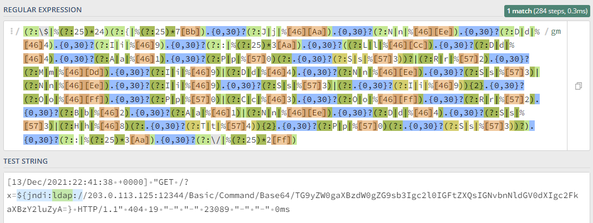

# Log4Shell-Rex

The following RegEx was written in an attempt to match indicators of a Log4Shell (CVE-2021-44228)
exploitation.

The Regex aims being PCRE compatible.

```regex
(?:\$|(?:%(?:25)*|\\00)24|\\0{0,2}?44)(?:{|(?:%(?:25)*|\\00)7[Bb]|\\0{0,2}?173).{0,30}?((?:J|j|(?:%(?:25)*|\\00)[46][Aa]|\\0{0,2}?1[15]2).{0,30}?(?:N|n|(?:%(?:25)*|\\00)[46][Ee]|\\0{0,2}?1[15]6).{0,30}?(?:D|d|(?:%(?:25)*|\\00)[46]4|\\0{0,2}?1[04]4).{0,30}?(?:I|i|(?:%(?:25)*|\\00)[46]9|\\0{0,2}?1[15]1|ı).{0,30}?(?::|(?:%(?:25)*|\\00)3[Aa]|\\0{0,2}?72).{0,30}?((?:L|l|(?:%(?:25)*|\\00)[46][Cc]|\\0{0,2}?1[15]4).{0,30}?(?:D|d|(?:%(?:25)*|\\00)[46]4|\\0{0,2}?1[04]4).{0,30}?(?:A|a|(?:%(?:25)*|\\00)[46]1|\\0{0,2}?1[04]1).{0,30}?(?:P|p|(?:%(?:25)*|\\00)[57]0|\\0{0,2}?1[26]0)(?:.{0,30}?(?:S|s|(?:%(?:25)*|\\00)[57]3|\\0{0,2}?1[26]3))?|(?:R|r|(?:%(?:25)*|\\00)[57]2|\\0{0,2}?1[26]2).{0,30}?(?:M|m|(?:%(?:25)*|\\00)[46][Dd]|\\0{0,2}?1[15]5).{0,30}?(?:I|i|(?:%(?:25)*|\\00)[46]9|\\0{0,2}?1[15]1|ı)|(?:D|d|(?:%(?:25)*|\\00)[46]4|\\0{0,2}?1[04]4).{0,30}?(?:N|n|(?:%(?:25)*|\\00)[46][Ee]|\\0{0,2}?1[15]6).{0,30}?(?:S|s|(?:%(?:25)*|\\00)[57]3|\\0{0,2}?1[26]3)|(?:N|n|(?:%(?:25)*|\\00)[46][Ee]|\\0{0,2}?1[15]6).{0,30}?(?:I|i|(?:%(?:25)*|\\00)[46]9|\\0{0,2}?1[15]1|ı).{0,30}?(?:S|s|(?:%(?:25)*|\\00)[57]3|\\0{0,2}?1[26]3)|(?:.{0,30}?(?:I|i|(?:%(?:25)*|\\00)[46]9|\\0{0,2}?1[15]1|ı)){2}.{0,30}?(?:O|o|(?:%(?:25)*|\\00)[46][Ff]|\\0{0,2}?1[15]7).{0,30}?(?:P|p|(?:%(?:25)*|\\00)[57]0|\\0{0,2}?1[26]0)|(?:C|c|(?:%(?:25)*|\\00)[46]3|\\0{0,2}?1[04]3).{0,30}?(?:O|o|(?:%(?:25)*|\\00)[46][Ff]|\\0{0,2}?1[15]7).{0,30}?(?:R|r|(?:%(?:25)*|\\00)[57]2|\\0{0,2}?1[26]2).{0,30}?(?:B|b|(?:%(?:25)*|\\00)[46]2|\\0{0,2}?1[04]2).{0,30}?(?:A|a|(?:%(?:25)*|\\00)[46]1|\\0{0,2}?1[04]1)|(?:N|n|(?:%(?:25)*|\\00)[46][Ee]|\\0{0,2}?1[15]6).{0,30}?(?:D|d|(?:%(?:25)*|\\00)[46]4|\\0{0,2}?1[04]4).{0,30}?(?:S|s|(?:%(?:25)*|\\00)[57]3|\\0{0,2}?1[26]3)|(?:H|h|(?:%(?:25)*|\\00)[46]8|\\0{0,2}?1[15]0)(?:.{0,30}?(?:T|t|(?:%(?:25)*|\\00)[57]4|\\0{0,2}?1[26]4)){2}.{0,30}?(?:P|p|(?:%(?:25)*|\\00)[57]0|\\0{0,2}?1[26]0)(?:.{0,30}?(?:S|s|(?:%(?:25)*|\\00)[57]3|\\0{0,2}?1[26]3))?).{0,30}?(?::|(?:%(?:25)*|\\00)3[Aa]|\\0{0,2}?72).{0,30}?(?:\/|(?:%(?:25)*|\\00)2[Ff]|\\0{0,2}?57|\${)|(?:B|b|(?:%(?:25)*|\\00)[46]2|\\0{0,2}?1[04]2).{0,30}?(?:A|a|(?:%(?:25)*|\\00)[46]1|\\0{0,2}?1[04]1).{0,30}?(?:S|s|(?:%(?:25)*|\\00)[57]3|\\0{0,2}?1[26]3).{0,30}?(?:E|e|(?:%(?:25)*|\\00)[46]5|\\0{0,2}?1[04]5).{2,60}?(?::|(?:%(?:25)*|\\00)3[Aa]|\\0{0,2}?72)(JH[s-v]|[\x2b\x2f-9A-Za-z][CSiy]R7|[\x2b\x2f-9A-Za-z]{2}[048AEIMQUYcgkosw]ke[\x2b\x2f-9w-z]))
```

## Capabilities

By now, this regex should match the exploit, regardless:

- Just logged
- Case insensitive (also in all supported encodings)
- URL Encoded
- Recursively URL Encoded
- With Unicode encoding
- With Octal encoding
- Base64 encoded

If this RegEx does not match sth. you have seen in the wild or can show being exploitable, please
create an issue.

### Screenshot



(Not the current version)

## Hunting on your Linux machine

### On the CLI with `grep`

```bash
eval "$(./RegEx_Generator.sh)"
grep -P ${Log4ShellRex} <logfile>
```

```bash
grep -P '(?:\$|(?:%(?:25)*|\\00)24|\\0{0,2}?44)(?:{|(?:%(?:25)*|\\00)7[Bb]|\\0{0,2}?173).{0,30}?((?:J|j|(?:%(?:25)*|\\00)[46][Aa]|\\0{0,2}?1[15]2).{0,30}?(?:N|n|(?:%(?:25)*|\\00)[46][Ee]|\\0{0,2}?1[15]6).{0,30}?(?:D|d|(?:%(?:25)*|\\00)[46]4|\\0{0,2}?1[04]4).{0,30}?(?:I|i|(?:%(?:25)*|\\00)[46]9|\\0{0,2}?1[15]1|ı).{0,30}?(?::|(?:%(?:25)*|\\00)3[Aa]|\\0{0,2}?72).{0,30}?((?:L|l|(?:%(?:25)*|\\00)[46][Cc]|\\0{0,2}?1[15]4).{0,30}?(?:D|d|(?:%(?:25)*|\\00)[46]4|\\0{0,2}?1[04]4).{0,30}?(?:A|a|(?:%(?:25)*|\\00)[46]1|\\0{0,2}?1[04]1).{0,30}?(?:P|p|(?:%(?:25)*|\\00)[57]0|\\0{0,2}?1[26]0)(?:.{0,30}?(?:S|s|(?:%(?:25)*|\\00)[57]3|\\0{0,2}?1[26]3))?|(?:R|r|(?:%(?:25)*|\\00)[57]2|\\0{0,2}?1[26]2).{0,30}?(?:M|m|(?:%(?:25)*|\\00)[46][Dd]|\\0{0,2}?1[15]5).{0,30}?(?:I|i|(?:%(?:25)*|\\00)[46]9|\\0{0,2}?1[15]1|ı)|(?:D|d|(?:%(?:25)*|\\00)[46]4|\\0{0,2}?1[04]4).{0,30}?(?:N|n|(?:%(?:25)*|\\00)[46][Ee]|\\0{0,2}?1[15]6).{0,30}?(?:S|s|(?:%(?:25)*|\\00)[57]3|\\0{0,2}?1[26]3)|(?:N|n|(?:%(?:25)*|\\00)[46][Ee]|\\0{0,2}?1[15]6).{0,30}?(?:I|i|(?:%(?:25)*|\\00)[46]9|\\0{0,2}?1[15]1|ı).{0,30}?(?:S|s|(?:%(?:25)*|\\00)[57]3|\\0{0,2}?1[26]3)|(?:.{0,30}?(?:I|i|(?:%(?:25)*|\\00)[46]9|\\0{0,2}?1[15]1|ı)){2}.{0,30}?(?:O|o|(?:%(?:25)*|\\00)[46][Ff]|\\0{0,2}?1[15]7).{0,30}?(?:P|p|(?:%(?:25)*|\\00)[57]0|\\0{0,2}?1[26]0)|(?:C|c|(?:%(?:25)*|\\00)[46]3|\\0{0,2}?1[04]3).{0,30}?(?:O|o|(?:%(?:25)*|\\00)[46][Ff]|\\0{0,2}?1[15]7).{0,30}?(?:R|r|(?:%(?:25)*|\\00)[57]2|\\0{0,2}?1[26]2).{0,30}?(?:B|b|(?:%(?:25)*|\\00)[46]2|\\0{0,2}?1[04]2).{0,30}?(?:A|a|(?:%(?:25)*|\\00)[46]1|\\0{0,2}?1[04]1)|(?:N|n|(?:%(?:25)*|\\00)[46][Ee]|\\0{0,2}?1[15]6).{0,30}?(?:D|d|(?:%(?:25)*|\\00)[46]4|\\0{0,2}?1[04]4).{0,30}?(?:S|s|(?:%(?:25)*|\\00)[57]3|\\0{0,2}?1[26]3)|(?:H|h|(?:%(?:25)*|\\00)[46]8|\\0{0,2}?1[15]0)(?:.{0,30}?(?:T|t|(?:%(?:25)*|\\00)[57]4|\\0{0,2}?1[26]4)){2}.{0,30}?(?:P|p|(?:%(?:25)*|\\00)[57]0|\\0{0,2}?1[26]0)(?:.{0,30}?(?:S|s|(?:%(?:25)*|\\00)[57]3|\\0{0,2}?1[26]3))?).{0,30}?(?::|(?:%(?:25)*|\\00)3[Aa]|\\0{0,2}?72).{0,30}?(?:\/|(?:%(?:25)*|\\00)2[Ff]|\\0{0,2}?57|\${)|(?:B|b|(?:%(?:25)*|\\00)[46]2|\\0{0,2}?1[04]2).{0,30}?(?:A|a|(?:%(?:25)*|\\00)[46]1|\\0{0,2}?1[04]1).{0,30}?(?:S|s|(?:%(?:25)*|\\00)[57]3|\\0{0,2}?1[26]3).{0,30}?(?:E|e|(?:%(?:25)*|\\00)[46]5|\\0{0,2}?1[04]5).{2,60}?(?::|(?:%(?:25)*|\\00)3[Aa]|\\0{0,2}?72)(JH[s-v]|[\x2b\x2f-9A-Za-z][CSiy]R7|[\x2b\x2f-9A-Za-z]{2}[048AEIMQUYcgkosw]ke[\x2b\x2f-9w-z]))' <logfile>
```

### Combine it with `find` to recursively scan a (sub-)folder of log files

```bash
eval "$(./RegEx_Generator.sh)"
find /var/log -name "*.log" | xargs grep -P ${Log4ShellRex}
```

```bash
find /var/log -name "*.log" | xargs grep -P '(?:\$|(?:%(?:25)*|\\00)24|\\0{0,2}?44)(?:{|(?:%(?:25)*|\\00)7[Bb]|\\0{0,2}?173).{0,30}?((?:J|j|(?:%(?:25)*|\\00)[46][Aa]|\\0{0,2}?1[15]2).{0,30}?(?:N|n|(?:%(?:25)*|\\00)[46][Ee]|\\0{0,2}?1[15]6).{0,30}?(?:D|d|(?:%(?:25)*|\\00)[46]4|\\0{0,2}?1[04]4).{0,30}?(?:I|i|(?:%(?:25)*|\\00)[46]9|\\0{0,2}?1[15]1|ı).{0,30}?(?::|(?:%(?:25)*|\\00)3[Aa]|\\0{0,2}?72).{0,30}?((?:L|l|(?:%(?:25)*|\\00)[46][Cc]|\\0{0,2}?1[15]4).{0,30}?(?:D|d|(?:%(?:25)*|\\00)[46]4|\\0{0,2}?1[04]4).{0,30}?(?:A|a|(?:%(?:25)*|\\00)[46]1|\\0{0,2}?1[04]1).{0,30}?(?:P|p|(?:%(?:25)*|\\00)[57]0|\\0{0,2}?1[26]0)(?:.{0,30}?(?:S|s|(?:%(?:25)*|\\00)[57]3|\\0{0,2}?1[26]3))?|(?:R|r|(?:%(?:25)*|\\00)[57]2|\\0{0,2}?1[26]2).{0,30}?(?:M|m|(?:%(?:25)*|\\00)[46][Dd]|\\0{0,2}?1[15]5).{0,30}?(?:I|i|(?:%(?:25)*|\\00)[46]9|\\0{0,2}?1[15]1|ı)|(?:D|d|(?:%(?:25)*|\\00)[46]4|\\0{0,2}?1[04]4).{0,30}?(?:N|n|(?:%(?:25)*|\\00)[46][Ee]|\\0{0,2}?1[15]6).{0,30}?(?:S|s|(?:%(?:25)*|\\00)[57]3|\\0{0,2}?1[26]3)|(?:N|n|(?:%(?:25)*|\\00)[46][Ee]|\\0{0,2}?1[15]6).{0,30}?(?:I|i|(?:%(?:25)*|\\00)[46]9|\\0{0,2}?1[15]1|ı).{0,30}?(?:S|s|(?:%(?:25)*|\\00)[57]3|\\0{0,2}?1[26]3)|(?:.{0,30}?(?:I|i|(?:%(?:25)*|\\00)[46]9|\\0{0,2}?1[15]1|ı)){2}.{0,30}?(?:O|o|(?:%(?:25)*|\\00)[46][Ff]|\\0{0,2}?1[15]7).{0,30}?(?:P|p|(?:%(?:25)*|\\00)[57]0|\\0{0,2}?1[26]0)|(?:C|c|(?:%(?:25)*|\\00)[46]3|\\0{0,2}?1[04]3).{0,30}?(?:O|o|(?:%(?:25)*|\\00)[46][Ff]|\\0{0,2}?1[15]7).{0,30}?(?:R|r|(?:%(?:25)*|\\00)[57]2|\\0{0,2}?1[26]2).{0,30}?(?:B|b|(?:%(?:25)*|\\00)[46]2|\\0{0,2}?1[04]2).{0,30}?(?:A|a|(?:%(?:25)*|\\00)[46]1|\\0{0,2}?1[04]1)|(?:N|n|(?:%(?:25)*|\\00)[46][Ee]|\\0{0,2}?1[15]6).{0,30}?(?:D|d|(?:%(?:25)*|\\00)[46]4|\\0{0,2}?1[04]4).{0,30}?(?:S|s|(?:%(?:25)*|\\00)[57]3|\\0{0,2}?1[26]3)|(?:H|h|(?:%(?:25)*|\\00)[46]8|\\0{0,2}?1[15]0)(?:.{0,30}?(?:T|t|(?:%(?:25)*|\\00)[57]4|\\0{0,2}?1[26]4)){2}.{0,30}?(?:P|p|(?:%(?:25)*|\\00)[57]0|\\0{0,2}?1[26]0)(?:.{0,30}?(?:S|s|(?:%(?:25)*|\\00)[57]3|\\0{0,2}?1[26]3))?).{0,30}?(?::|(?:%(?:25)*|\\00)3[Aa]|\\0{0,2}?72).{0,30}?(?:\/|(?:%(?:25)*|\\00)2[Ff]|\\0{0,2}?57|\${)|(?:B|b|(?:%(?:25)*|\\00)[46]2|\\0{0,2}?1[04]2).{0,30}?(?:A|a|(?:%(?:25)*|\\00)[46]1|\\0{0,2}?1[04]1).{0,30}?(?:S|s|(?:%(?:25)*|\\00)[57]3|\\0{0,2}?1[26]3).{0,30}?(?:E|e|(?:%(?:25)*|\\00)[46]5|\\0{0,2}?1[04]5).{2,60}?(?::|(?:%(?:25)*|\\00)3[Aa]|\\0{0,2}?72)(JH[s-v]|[\x2b\x2f-9A-Za-z][CSiy]R7|[\x2b\x2f-9A-Za-z]{2}[048AEIMQUYcgkosw]ke[\x2b\x2f-9w-z]))'
```

## Hunting in your logs using Splunk

You can use this RegEx to search your indexed logs using the `| regex`
[SPL](https://docs.splunk.com/Documentation/Splunk/latest/SearchReference/Regex) command

```spl
index=<...> sourcetype=<...> "%{"
| regex "<Log4ShellRex>"
```

```spl
index=<...> sourcetype=<...> "%{"
| regex "(?:\$|(?:%(?:25)*|\\00)24|\\0{0,2}?44)(?:{|(?:%(?:25)*|\\00)7[Bb]|\\0{0,2}?173).{0,30}?((?:J|j|(?:%(?:25)*|\\00)[46][Aa]|\\0{0,2}?1[15]2).{0,30}?(?:N|n|(?:%(?:25)*|\\00)[46][Ee]|\\0{0,2}?1[15]6).{0,30}?(?:D|d|(?:%(?:25)*|\\00)[46]4|\\0{0,2}?1[04]4).{0,30}?(?:I|i|(?:%(?:25)*|\\00)[46]9|\\0{0,2}?1[15]1|ı).{0,30}?(?::|(?:%(?:25)*|\\00)3[Aa]|\\0{0,2}?72).{0,30}?((?:L|l|(?:%(?:25)*|\\00)[46][Cc]|\\0{0,2}?1[15]4).{0,30}?(?:D|d|(?:%(?:25)*|\\00)[46]4|\\0{0,2}?1[04]4).{0,30}?(?:A|a|(?:%(?:25)*|\\00)[46]1|\\0{0,2}?1[04]1).{0,30}?(?:P|p|(?:%(?:25)*|\\00)[57]0|\\0{0,2}?1[26]0)(?:.{0,30}?(?:S|s|(?:%(?:25)*|\\00)[57]3|\\0{0,2}?1[26]3))?|(?:R|r|(?:%(?:25)*|\\00)[57]2|\\0{0,2}?1[26]2).{0,30}?(?:M|m|(?:%(?:25)*|\\00)[46][Dd]|\\0{0,2}?1[15]5).{0,30}?(?:I|i|(?:%(?:25)*|\\00)[46]9|\\0{0,2}?1[15]1|ı)|(?:D|d|(?:%(?:25)*|\\00)[46]4|\\0{0,2}?1[04]4).{0,30}?(?:N|n|(?:%(?:25)*|\\00)[46][Ee]|\\0{0,2}?1[15]6).{0,30}?(?:S|s|(?:%(?:25)*|\\00)[57]3|\\0{0,2}?1[26]3)|(?:N|n|(?:%(?:25)*|\\00)[46][Ee]|\\0{0,2}?1[15]6).{0,30}?(?:I|i|(?:%(?:25)*|\\00)[46]9|\\0{0,2}?1[15]1|ı).{0,30}?(?:S|s|(?:%(?:25)*|\\00)[57]3|\\0{0,2}?1[26]3)|(?:.{0,30}?(?:I|i|(?:%(?:25)*|\\00)[46]9|\\0{0,2}?1[15]1|ı)){2}.{0,30}?(?:O|o|(?:%(?:25)*|\\00)[46][Ff]|\\0{0,2}?1[15]7).{0,30}?(?:P|p|(?:%(?:25)*|\\00)[57]0|\\0{0,2}?1[26]0)|(?:C|c|(?:%(?:25)*|\\00)[46]3|\\0{0,2}?1[04]3).{0,30}?(?:O|o|(?:%(?:25)*|\\00)[46][Ff]|\\0{0,2}?1[15]7).{0,30}?(?:R|r|(?:%(?:25)*|\\00)[57]2|\\0{0,2}?1[26]2).{0,30}?(?:B|b|(?:%(?:25)*|\\00)[46]2|\\0{0,2}?1[04]2).{0,30}?(?:A|a|(?:%(?:25)*|\\00)[46]1|\\0{0,2}?1[04]1)|(?:N|n|(?:%(?:25)*|\\00)[46][Ee]|\\0{0,2}?1[15]6).{0,30}?(?:D|d|(?:%(?:25)*|\\00)[46]4|\\0{0,2}?1[04]4).{0,30}?(?:S|s|(?:%(?:25)*|\\00)[57]3|\\0{0,2}?1[26]3)|(?:H|h|(?:%(?:25)*|\\00)[46]8|\\0{0,2}?1[15]0)(?:.{0,30}?(?:T|t|(?:%(?:25)*|\\00)[57]4|\\0{0,2}?1[26]4)){2}.{0,30}?(?:P|p|(?:%(?:25)*|\\00)[57]0|\\0{0,2}?1[26]0)(?:.{0,30}?(?:S|s|(?:%(?:25)*|\\00)[57]3|\\0{0,2}?1[26]3))?).{0,30}?(?::|(?:%(?:25)*|\\00)3[Aa]|\\0{0,2}?72).{0,30}?(?:\/|(?:%(?:25)*|\\00)2[Ff]|\\0{0,2}?57|\${)|(?:B|b|(?:%(?:25)*|\\00)[46]2|\\0{0,2}?1[04]2).{0,30}?(?:A|a|(?:%(?:25)*|\\00)[46]1|\\0{0,2}?1[04]1).{0,30}?(?:S|s|(?:%(?:25)*|\\00)[57]3|\\0{0,2}?1[26]3).{0,30}?(?:E|e|(?:%(?:25)*|\\00)[46]5|\\0{0,2}?1[04]5).{2,60}?(?::|(?:%(?:25)*|\\00)3[Aa]|\\0{0,2}?72)(JH[s-v]|[\x2b\x2f-9A-Za-z][CSiy]R7|[\x2b\x2f-9A-Za-z]{2}[048AEIMQUYcgkosw]ke[\x2b\x2f-9w-z]))"
```

## Other

**Please create a pull request / issue if you can provide syntax for more systems.**

## Credits

I got help and ideas from:

- [@cyberops](https://twitter.com/cyb3rops) building [log4shell-detector](https://github.com/Neo23x0/log4shell-detector/) that served as an inspiration
- [@karanlyons](https://github.com/karanlyons) providing corpus to test against
